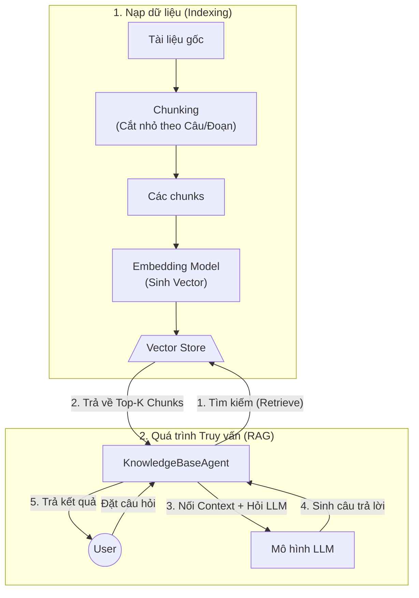

# Hướng dẫn học tập Phase 1: Embedding & Vector Store

Tài liệu này giải thích chi tiết những dòng code đã được implement trong Phase 1 (Bài tập cá nhân) để bạn có thể nắm vững kiến thức về RAG (Retrieval-Augmented Generation).

## Tổng quan Luồng hoạt động (RAG Architecture)

Sơ đồ dưới đây tóm tắt quy trình hệ thống từ lúc nạp tài liệu vào (Data Ingestion) đến lúc trả lời câu hỏi của người dùng (Query Flow):



---

## 1. Chunking - Cắt nhỏ văn bản (`src/chunking.py`)

Khi đưa một tài liệu dài vào mô hình AI, ta không thể đưa toàn bộ cùng lúc (do giới hạn token). Do đó, ta cần "chunking" - cắt tài liệu thành các đoạn nhỏ.

### 1.1. SentenceChunker
Mục tiêu là cắt văn bản thành từng nhóm câu (ví dụ: mỗi chunk chứa tối đa 3 câu).

**Cách làm:**
```python
parts = re.split(r'(\. |\! |\? |\.\n)', text)
```
- **Tại sao dùng `re.split` với Regex ngoặc tròn `(...)`?** 
  Nếu dùng split thông thường `text.split('.')`, ta sẽ làm mất đi dấu chấm. Việc đặt regex trong ngoặc tròn `(...)` giúp `re.split` trả về cả nội dung bị cắt và **cả dấu phân cách**.
- Sau đó, vòng lặp `for i in range(0, len(parts), 2)` sẽ lấy phần chữ (part) ghép lại với phần dấu (sep) để khôi phục lại câu hoàn chỉnh. Cuối cùng, gom các câu thành từng mảng dựa vào `max_sentences_per_chunk`.

### 1.2. RecursiveChunker
Cách này cắt văn bản thông minh hơn: Cố gắng cắt bằng đoạn văn (`\n\n`), nếu đoạn văn vẫn quá dài thì cắt bằng câu (`\n` hoặc `. `), nếu vẫn dài thì cắt bằng chữ (` `).

**Cách làm:**
- Hàm đệ quy `_split` nhận vào văn bản và danh sách các dấu phân cách `remaining_separators`.
- **Base case (Điểm dừng đệ quy):** Nếu `len(current_text) <= chunk_size` (văn bản đã đủ nhỏ), trả về luôn. Hoặc nếu hết `remaining_separators`, cắt cứng theo số lượng ký tự.
- **Logic:** Tách văn bản bằng dấu phân cách đầu tiên (ví dụ `\n\n`). Thử gộp các mảnh lại với nhau, nếu vượt quá `chunk_size` thì đẩy phần đã gộp vào mảng `chunks` và bắt đầu đoạn gộp mới. 
- Cuối cùng, nếu mảnh nào vẫn quá lớn, hàm gọi đệ quy `self._split(c, next_separators)` với các dấu phân cách nhỏ hơn tiếp theo.

### 1.3. Tính Cosine Similarity (`compute_similarity`)
Hàm tính độ tương đồng giữa hai vector bằng Cosine Similarity.
**Tại sao dùng Cosine Similarity thay vì Khoảng cách khoảng cách Euclidean?**
Bởi vì Cosine đo **góc** giữa hai vector (hướng) chứ không đo **độ dài** của vector. Text dài hay ngắn không quan trọng bằng việc chúng "trỏ" về cùng một ngữ nghĩa.

**Công thức:** `(A dot B) / (||A|| * ||B||)`
```python
dot_product = _dot(vec_a, vec_b)
mag_a = math.sqrt(sum(x * x for x in vec_a))
mag_b = math.sqrt(sum(x * x for x in vec_b))
```
Ta tính tích vô hướng (dot product) chia cho tích độ dài (magnitude). Lưu ý phải bắt lỗi chia cho `0` nếu vector rỗng.

---

## 2. Vector Store - Lưu trữ Vector (`src/store.py`)

File này đóng vai trò như một cơ sở dữ liệu Vector (Vector Database) thủ công, hỗ trợ 2 chế độ: dùng `chromadb` (nếu có cài) hoặc dùng list `in-memory` (chạy trên RAM).

### 2.1. Tìm kiếm In-Memory (`_search_records`)
- Duyệt qua từng record đã lưu.
- Dùng `_dot` (cosine similarity / dot product) để tính điểm số giữa vector của câu hỏi (`query_emb`) và vector của tài liệu (`record["embedding"]`).
- Sắp xếp điểm số giảm dần và lấy ra `top_k` phần tử cao nhất.

### 2.2. Tìm kiếm kèm bộ lọc (`search_with_filter`)
Trong thực tế, bạn thường muốn kết hợp AI search với SQL filter truyền thống (Ví dụ: "Tìm tài liệu về chính sách, NHƯNG chỉ lấy phòng Nhân sự").
- **Tại sao filter trước khi tính điểm?** Nếu ta tính điểm toàn bộ database rồi mới loại đi phòng ban khác sẽ rất tốn kém tài nguyên. Ở in-memory, ta dùng vòng lặp `for` lặp qua metadata để lọc ra mảng `filtered`, sau đó mới gọi hàm `_search_records` trên mảng `filtered` đó.

---

## 3. Knowledge Base Agent - Trí tuệ nhân tạo RAG (`src/agent.py`)

Đây là nơi gắn kết hệ thống lại với nhau tạo thành luồng RAG (Retrieval-Augmented Generation).

**Các bước (Quy trình RAG tiêu chuẩn):**
1. **Retrieve (Truy xuất):** Gọi `store.search(question)` để lấy ra top tài liệu liên quan nhất.
2. **Augment (Bổ sung):** Trích xuất nội dung chữ (`content`) từ các tài liệu tìm được và ghép lại với nhau bằng dấu xuống dòng `\n\n`.
3. **Generate (Sinh văn bản):** Tạo một Prompt nhét cả nội dung vừa tìm được (`context_str`) và câu hỏi của user (`question`), yêu cầu LLM "Trả lời dựa trên ngữ cảnh". Cuối cùng gọi hàm `llm_fn` để lấy câu trả lời cuối.

```python
results = self.store.search(question, top_k=top_k)
contexts = [r['content'] for r in results]
context_str = "\n\n".join(contexts)
prompt = f"Context:\n{context_str}\n\nQuestion:\n{question}\n\nAnswer based on context:"
return self.llm_fn(prompt)
```

**Tại sao RAG lại quan trọng?** Nó giúp AI (LLM) không bịa (hallucinate) thông tin, vì nó luôn phải đọc `Context` mà hệ thống cung cấp từ Database nội bộ trước khi trả lời.
